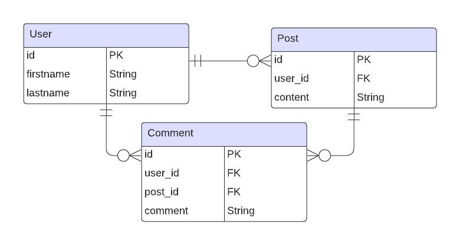

# Forum App API
Welcome to the documentation for the Forum App API. This API serves as the backend for a forum application and allows users to perform various actions related to forum topics, posts, and user management.

The API provides the following endpoints:

- `/comments`: Endpoints for creating and deleting forum comments.
- `/posts`: Endpoints for creating, reading, and deleting forum posts.
- `/users`: Endpoints for user creation and login operations.

## Entity-Relationship Diagram (ERD)

Below is the Entity-Relationship Diagram (ERD) representing the database schema used by the API:
